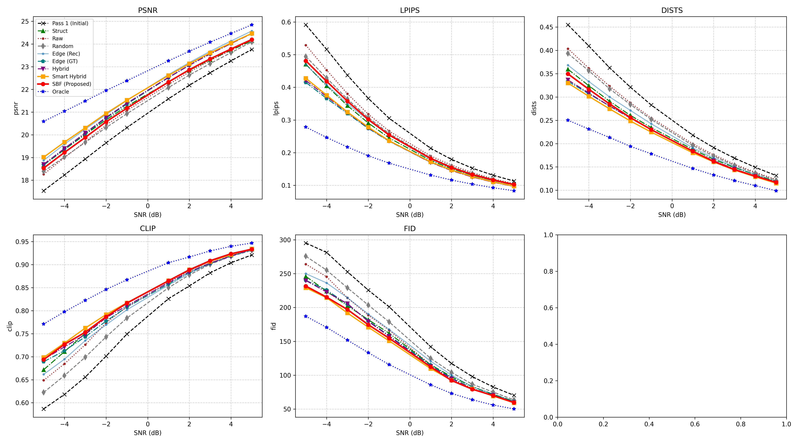

# DiffCom Retransmission Simulation (COCO / txt2img256)

このリポジトリは、Latent Diffusion Model (LDM) を用いた「意味的通信（Semantic Communication）」および「再送制御（Retransmission）」のシミュレーション環境です。

現在は **COCOデータセット** を対象に、**Text-to-Image (txt2img256)** モデルを用いて実験を行っています。
通信路上のノイズ（AWGN）によって劣化した画像を、**受信側で推定した「不確実性（Uncertainty）」**や**「セマンティック情報（物体領域）」**に基づいて部分的に再送要求し、インペインティング技術を用いて修復します。

---

## 🛠 環境構築 (Installation)

### 1. Python環境のセットアップ
提供されている `environment.yaml` を使用して conda 環境を作成します。

```
conda env create -f environment.yaml
conda activate ldm
```

### 2. 必須ライブラリの追加インストール
COCOデータセットでのセマンティックセグメンテーション（Mask2Former）および評価指標計算のために、以下のライブラリを追加でインストールしてください。

Mask2Former (Transformers), LPIPS, DISTS, FIDなどの評価用ライブラリ
```
pip install transformers lpips DISTS-pytorch pytorch-fid
```

### 使用方法 (Usage)
COCOデータセットおよび txt2img256 モデルを使用した基本的な実行コマンド例です。
```
python img2img.py \
  --input_dir data/coco_val2017 \
  --output_dir results/experiment_coco_v1 \
  --config models/ldm/text2img256/config.yaml \
  --ckpt models/ldm/text2img256/model.ckpt \
  --snr -5.0 \
  --retransmission_rate 0.2 \
  --target_methods all
```
主な引数引数説明--configモデル設定ファイル（例: models/ldm/text2img256/config.yaml）--ckpt学習済みモデルのチェックポイント（例: models/ldm/text2img256/model.ckpt）--input_dir入力画像のディレクトリ（例: COCOの検証データなど）--snr通信路のSN比 (dB)。値が小さいほどノイズが強くなります（例: -5.0 〜 5.0）。-r, --retransmission_rate再送予算 (0.0 〜 1.0)。画像の何割のピクセルを再送するかを指定します。--target_methods比較する手法を指定。all で全手法を実行、または個別に指定（smart_hybrid, oracle 等）。--struct_alphaStructural手法での不確実性とランダムノイズの混合比。--hybrid_alpha / --betaHybrid手法での不確実性とエッジ情報の重み付け。

📊 比較手法 (Benchmarks / Target Methods)--target_methods で指定可能な戦略一覧です。メソッド名説明structural構造的不確実性: 時間的な不確実性マップを平滑化し、構造的な欠損を優先して再送します。rawRaw Uncertainty: 拡散モデルのサンプリング過程で得られる生の不確実性を使用します。smart_hybridSmart Hybrid (提案手法): 不確実性とエッジ/セマンティック情報を賢く統合した手法です。semanticSemantic Weighted: 受信側の不確実性と、セマンティック重要度（物体領域など）を掛け合わせます。edge_recEdge (Rec): 再構成画像から抽出したエッジ周辺を再送します。edge_gtEdge (GT): Oracle手法。正解画像のエッジを使用する理論的上限値です。oracleOracle Error: 実際の誤差（Ground Truthとの差分）を知っていると仮定した理想的な再送戦略。randomRandom: 領域をランダムに選択するベースラインです。

### 実験結果
